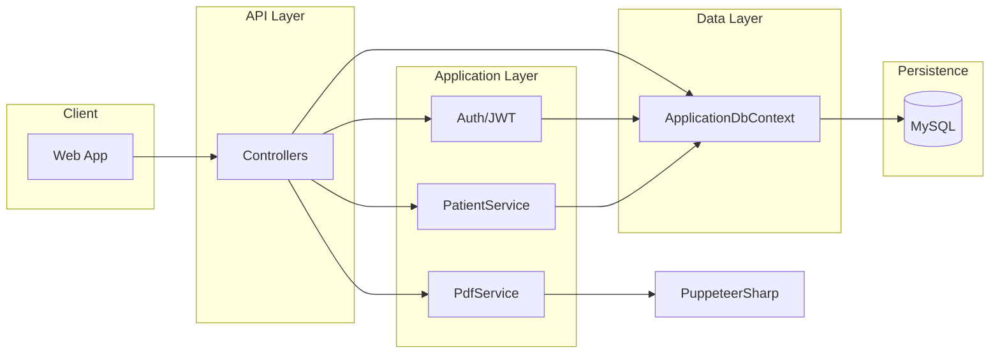

# ClinicOps – Project Overview for Junior .NET Interview

This document describes the **ClinicOps** backend project in detail so you can confidently introduce it in a junior .NET developer interview.

---

## 1. What Is ClinicOps?

**ClinicOps** is a **clinic operations management** system. It is a **multi-tenant** backend API that supports:

- **SuperAdmin**: Approves or rejects clinic applications; can work across clinics.
- **Clinics**: Each clinic has its own profile (name, logo, address, etc.) and users (Doctors, Nurses, Lab Technicians, ClinicAdmin).
- **Patient flow**: Register patients at reception → create a **patient case** (visit) → nurse records **vital signs** → doctor writes **medical report** (anamnesis, diagnosis, therapy) → generate **PDF report** with doctor signature and stamp.
- **Real-time updates**: When a nurse saves vitals or a doctor saves a report, other users (e.g. doctors) see the update immediately via **SignalR**.

So in one sentence for the interview:  
*"ClinicOps is a .NET 8 Web API for clinic operations: multi-tenant, role-based, with JWT auth, real-time updates via SignalR, and PDF report generation using PuppeteerSharp."*

---

## 2. Tech Stack

| Technology | Purpose |
|------------|--------|
| **.NET 8** | Runtime and framework |
| **ASP.NET Core Web API** | REST API (controllers, minimal hosting) |
| **Entity Framework Core 8** | ORM for database access |
| **MySQL** | Database (via **Pomelo.EntityFrameworkCore.MySql**) |
| **ASP.NET Core Identity** | Users, roles, password hashing |
| **JWT Bearer** | Stateless authentication for API and SignalR |
| **SignalR** | Real-time hub (e.g. vitals/report updates) |
| **PuppeteerSharp** | Headless Chromium to generate PDFs from HTML |
| **Swagger / OpenAPI** | API documentation (Development) |

---

## 3. Solution and Project Structure

- **Single solution** (`clinicops.sln`) with **one project** (`clinicops.csproj`).
- Code is organized in **folders by responsibility** (no separate class-library projects; everything is in one Web project).

### Main folders

```
clinicops/
├── API/                    # Web API layer
│   ├── Controllers/        # REST controllers
│   ├── DTOs/               # Data transfer objects (requests/responses)
│   └── Hubs/               # SignalR hubs
├── Application/            # Application / service layer
│   └── Services/           # Business logic (Auth, Patient, Pdf)
├── Domain/                 # Domain layer
│   ├── Entities/           # Entity classes
│   └── Enums/              # Enums (e.g. PatientCaseStatus)
├── Data/                   # Data / infrastructure (namespace: Infrastructure.Data)
│   ├── ApplicationDbContext.cs
│   ├── DesignTimeDbContextFactory.cs  # For EF tools
│   └── Seed/               # Role seeding
├── Migrations/             # EF Core migrations
├── wwwroot/                # Static files (e.g. uploads)
├── Program.cs              # App entry, DI, middleware
└── appsettings.json        # Config (DB, JWT, etc.)
```

For the interview you can say:  
*"We use a layered structure: API for HTTP, Application for services, Domain for entities and enums, and Data for EF Core and database. It’s not strict Clean Architecture but the separation is clear."*

---

## 4. Architecture in Short



- **Controllers** receive HTTP requests, validate input, call **services** or **DbContext**, return DTOs.
- **Services** (e.g. `PatientService`, `JwtTokenService`, `CaseReportPdfService`) contain business logic.
- **DbContext** is used by both some controllers and by services; identity is in the same DB via `IdentityDbContext<ApplicationUser>`.

---

## 5. Domain Model (Entities)

### Core entities

| Entity | Description |
|--------|-------------|
| **ApplicationUser** | Extends ASP.NET Identity `IdentityUser`. Adds `ClinicId`, `DoctorDisplayName`, `SignatureUrl`, `StampUrl`, `CreatedAt`, `IsActive`. |
| **Clinic** | Tenant: `Name`, `Address`, `Phone`, `LogoUrl`, `Description`, `IsActive`. |
| **ClinicApplication** | Request to join as a clinic: `ClinicName`, `AdminEmail`, `AdminPasswordHash`, `Status` (Pending/Approved/Rejected), `ReviewNote`. |
| **Patient** | Belongs to a clinic: `FirstName`, `LastName`, `DateOfBirth`, `Gender`, `Phone`, etc. |
| **PatientCase** | One visit/episode: links `Patient` and `Clinic`, has `Status` (Waiting → InProgress → InConsultation → Completed → Finished), `Notes`, `CompletedAt`. |
| **VitalSigns** | One record per case: `WeightKg`, `SystolicPressure`, `DiastolicPressure`, `TemperatureC`, `HeartRate`, `RecordedAt`. |
| **MedicalReport** | One per case (1:1): `Anamneza`, `Diagnosis`, `Therapy`, `DoctorUserId`, `CreatedAt`. |
| **LabResult** | For lab files (fileName, path, etc.) – structure present for future use. |
| **Payment** | For payments linked to a case – structure present for future use. |

### Important relationships

- **ApplicationUser** → **Clinic** (many-to-one; `ClinicId`).
- **Patient** → **Clinic** (many-to-one).
- **PatientCase** → **Patient**, **Clinic** (many-to-one); delete behavior: cascade from PatientCase to dependent data.
- **VitalSigns**, **MedicalReport**, **LabResult**, **Payment** → **PatientCase** (and Clinic where needed).

All IDs are **Guid** except **ClinicApplication** (int). Enums: `PatientCaseStatus`, `ApplicationStatus`.

For the interview:  
*"We have a multi-tenant model: users and patients are scoped by Clinic. A patient visit is a PatientCase; we store vitals and one medical report per case, and we can generate a PDF from that data."*

---

## 6. Authentication and Authorization

### Authentication

- **JWT Bearer** only (no cookies for the API).
- Configured in `Program.cs`: `AddAuthentication(JwtBearerDefaults.AuthenticationScheme)` and `AddJwtBearer` with validation parameters (Issuer, Audience, Key, lifetime).
- **Token creation**: `JwtTokenService` (in `Application/Services/Auth`) builds the JWT with claims: `Sub`, `Email`, `NameIdentifier`, **roles** (`ClaimTypes.Role`), **primaryRole**, and for clinic users **clinicId** and **clinicName**.
- **SignalR**: JWT can be sent via query string `?access_token=...` for the `/hubs/clinic` endpoint (see `OnMessageReceived` in `Program.cs`).

### Authorization (roles)

- Roles are stored and managed with **ASP.NET Core Identity** (`RoleManager`, `UserManager`).
- **RoleSeeder** (run at startup) ensures these roles exist: `SuperAdmin`, `ClinicAdmin`, `Doctor`, `Nurse`, `LabTechnician`, `Manager`.
- Controllers use `[Authorize]` or `[Authorize(Roles = "Doctor")]`, etc.
- **SuperAdmin** has no `ClinicId` in the token; clinic users have `clinicId` and are restricted to that clinic.

### Login flow

1. **POST** `/api/auth/login` with `email` and `password`.
2. Find user by email, check password with `SignInManager.CheckPasswordSignInAsync`.
3. Get roles, then call `JwtTokenService.CreateToken(user, roles)`.
4. Return `AuthResponse`: `accessToken`, `expiresAtUtc`, `user` (id, email, clinicId, clinicName, role).

### Clinic application flow (no auth)

1. **POST** `/api/auth/apply` with `clinicName`, `email`, `password`.
2. Create a **ClinicApplication** with hashed password and `Status = Pending`; no user is created yet.
3. **SuperAdmin** lists applications (**GET** `/api/ClinicApplication`), then **POST** `/api/ClinicApplication/{id}/approve` or `.../reject`.
4. On **approve**: create **Clinic** and **ApplicationUser** (ClinicAdmin) with the stored hash, add role `ClinicAdmin`, set application to Approved. The admin can then log in with the same email/password.

You can say:  
*"We use JWT with Identity for users and roles. Claims include clinicId so we can scope data per clinic. SignalR uses the same JWT, passed in the query string for the hub."*

---

## 7. API Controllers and Main Endpoints

| Controller | Auth | Main endpoints |
|------------|------|-----------------|
| **AuthController** | Login: none; Apply: none | `POST /api/auth/login`, `POST /api/auth/apply` |
| **ClinicApplicationController** | SuperAdmin | `GET /api/ClinicApplication`, `POST .../approve`, `POST .../reject` |
| **ClinicUserController** | ClinicAdmin, SuperAdmin | `GET /api/ClinicUser`, `POST /api/ClinicUser` (create Doctor/Nurse/LabTechnician) |
| **ClinicController** | Any authenticated (clinic users only for profile) | `GET/PUT /api/Clinic/profile`, `POST /api/Clinic/profile/logo` |
| **DoctorProfileController** | Doctor | `GET/PUT /api/DoctorProfile/profile`, `POST .../signature`, `POST .../stamp` |
| **PatientController** | Authenticated | `POST /api/Patient/register`, `GET /api/Patient` |
| **PatientCaseController** | Authenticated | `GET /api/PatientCase`, `GET /api/PatientCase/{id}`, `POST .../vitals`, `POST .../report`, `PATCH .../status`, `GET .../pdf` |

- **ClinicId** for clinic-scoped endpoints comes from JWT claim `clinicId` for clinic users; SuperAdmin may use a default clinic or (where supported) a query/body parameter.
- File uploads (logo, signature, stamp) go to `wwwroot/uploads/...` and URLs are stored (e.g. `LogoUrl`, `SignatureUrl`, `StampUrl`).

---

## 8. Application Services

| Service | Interface | Responsibility |
|---------|------------|----------------|
| **JwtTokenService** | `IJwtTokenService` | Build JWT with claims (sub, email, roles, clinicId, clinicName). |
| **AuthService** | (used optionally) | Login flow: validate user, get roles, create token and `AuthResponse`. |
| **PatientService** | `IPatientService` | Register patient at reception: create or reuse **Patient**, create **PatientCase** with status Waiting; return DTO with `PatientCaseId` and status. |
| **CaseReportPdfService** | `ICaseReportPdfService` | Build HTML from `PatientCaseReportModel`, then use **PuppeteerSharp** to generate PDF bytes. |

All registered in `Program.cs` as **Scoped** (e.g. `AddScoped<IJwtTokenService, JwtTokenService>`).

---

## 9. Data Layer

- **ApplicationDbContext** extends **IdentityDbContext&lt;ApplicationUser&gt;** and defines `DbSet`s for Clinics, Patients, PatientCases, VitalSigns, MedicalReports, LabResults, Payments, ClinicApplications.
- **OnModelCreating**: configures relationships (e.g. User → Clinic, Patient → Clinic, PatientCase → Patient/Clinic, VitalSigns/MedicalReport/LabResult/Payment → PatientCase) and **seed data**: default **SuperAdmin** user and role, and a default **Clinic** for testing.
- **Database**: MySQL; connection string in `appsettings.json` under `ConnectionStrings:DefaultConnection`.
- **Migrations**: EF Core migrations in the `Migrations` folder (e.g. NewInit, ChangesToClinic, AddAnamnezaToMedicalReport). Design-time factory: **DesignTimeDbContextFactory** reads `appsettings.json` and builds `ApplicationDbContext` for `dotnet ef` commands.

---

## 10. Real-Time (SignalR)

- **Hub**: `ClinicHub` at `/hubs/clinic`; `[Authorize]` so only authenticated clients connect.
- **Client → Server**: `JoinClinic(clinicId)` adds the connection to group `clinic_{clinicId}`; `JoinPatientCase(patientCaseId)` adds to `case_{patientCaseId}`.
- **Server → Client**: Controllers use `IHubContext<ClinicHub>` to send:
  - **VitalsUpdated**(patientCaseId, vitalsDto) when a nurse saves vitals.
  - **ReportUpdated**(patientCaseId, reportDto) when a doctor saves the medical report.
  - **CaseStatusChanged**(patientCaseId, status) when case status is updated.
- Target groups: `ClinicHub.GroupPrefix + clinicId` and optionally `"case_" + id`.

So: *"We use SignalR so that when a nurse records vitals or a doctor saves a report, the doctor’s UI updates in real time without refreshing."*

---

## 11. PDF Report Generation

- **Endpoint**: **GET** `/api/PatientCase/{id}/pdf` (authenticated).
- **Flow**: Load case (with patient, clinic, latest vitals, medical report); resolve doctor’s display name and signature/stamp URLs (and optionally read files as base64 data URIs for embedding). Build **PatientCaseReportModel** and call **ICaseReportPdfService.GenerateCaseReportPdfAsync**.
- **CaseReportPdfService**: Builds one big HTML string (tables and sections for patient data, vitals, anamneza, diagnosis, therapy, doctor signature and stamp), then uses **PuppeteerSharp** to launch headless Chromium, set content, and call `page.PdfDataAsync()` with A4 and margins. Returns PDF bytes; controller returns `File(pdfBytes, "application/pdf", fileName)`.

For the interview: *"We generate the case report PDF by building an HTML template with patient info, vitals, and medical report, then we use PuppeteerSharp to render it to PDF so we get a consistent, printable document with the doctor’s signature and stamp."*

---

## 12. CORS and Static Files

- **CORS** policy `"ClinicOpsCors"` allows origins `http://localhost:3000` and `http://localhost:5173` (typical React/Vite dev ports), with any method and header and credentials.
- **Static files** from `wwwroot` (e.g. `uploads/clinics/...`, `uploads/doctors/...`) are served so the frontend and PDF can reference logo/signature/stamp URLs.

---

## 13. How to Introduce the Project in an Interview (Short Script)

You can use something like this:

- *"ClinicOps is a backend API I worked on for clinic operations. It’s built with .NET 8 and ASP.NET Core Web API."*
- *"It’s multi-tenant: we have clinics, and each clinic has its own users—doctors, nurses, lab technicians—and patients. We use ASP.NET Core Identity for users and roles, and JWT for API and SignalR authentication. The token includes the user’s role and clinic ID so we can scope all data per clinic."*
- *"Main flows: clinics apply to join, a SuperAdmin approves and we create the clinic and an admin user; then clinic admins create doctors and nurses. At reception we register patients and create a patient case. Nurses record vital signs, doctors write the medical report (anamnesis, diagnosis, therapy). When vitals or the report are saved, we push updates in real time via SignalR so the doctor’s screen updates without refresh. We also generate a PDF of the case report using PuppeteerSharp, including the doctor’s signature and stamp."*
- *"The code is organized in layers: API controllers, application services for auth and business logic, domain entities, and a data layer with EF Core and MySQL. We use DTOs for requests and responses and keep the domain model clear."*

---

## 14. Possible Follow-Up Questions and Answers

- **Why JWT?** Stateless auth; the frontend can send the token on each request and we don’t need server-side session storage. Good for APIs and SignalR.
- **Why SignalR here?** So nurse and doctor UIs stay in sync when vitals or reports change, without polling.
- **Why PuppeteerSharp for PDF?** We need a formatted, printable report (tables, layout, images). HTML + CSS is easy to maintain; Chromium gives consistent rendering and good PDF output.
- **Multi-tenancy?** Every clinic-scoped entity has `ClinicId`. We resolve `ClinicId` from the JWT and filter all queries so users only see their clinic’s data (except SuperAdmin, which can use a default or specified clinic).
- **Dependency injection?** Controllers and services receive dependencies via constructor injection; in `Program.cs` we register DbContext, Identity, JWT, and our services (e.g. `IJwtTokenService`, `IPatientService`, `ICaseReportPdfService`) as Scoped.

---

## 15. References in the Repo

- [docs/API-FRONTEND.md](API-FRONTEND.md) – Full API list and frontend integration notes.
- [docs/FRONTEND-PROMPT-CLINIC-PROFILE.md](FRONTEND-PROMPT-CLINIC-PROFILE.md), [docs/FRONTEND-PROMPT-DOCTOR-PROFILE.md](FRONTEND-PROMPT-DOCTOR-PROFILE.md) – Frontend-focused prompts for clinic and doctor profile.

Good luck in your junior .NET interview.
