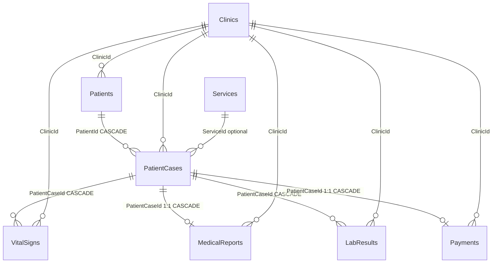

# Patient — Tables & Relations

Focused view of everything tied to **patients** and **patient cases** (for ERM / adding fields).

---

## Patient-centric diagram



---

## Flow (one patient visit)

```
Clinic
  └── Patient                    ← person record (name, DOB, phone…)
        └── PatientCase          ← one visit / queue item
              ├── VitalSigns     ← 0..many (weight, BP, temp…)
              ├── MedicalReport  ← 0..1 (diagnosis, therapy, anamneza)
              ├── LabResult      ← 0..many (PDF files)
              └── Payment        ← 0..1 (amount, method)
              └── Service?       ← optional link to clinic service catalog
```

---

## Tables directly about patients

### `Patients`

| Column | Wired to |
|--------|----------|
| `Id` | PK |
| `ClinicId` | **FK → `Clinics.Id`** (Restrict) |
| `FirstName`, `LastName`, `DateOfBirth`, `Gender`, `Phone` | — |
| `CreatedAt`, `IsActive` | — |

**Incoming:** `PatientCases.PatientId` (many cases per patient)

**Outgoing:** `Clinics` only

---

### `PatientCases`

| Column | Wired to |
|--------|----------|
| `Id` | PK |
| `ClinicId` | **FK → `Clinics.Id`** (Restrict) |
| `PatientId` | **FK → `Patients.Id`** (Cascade) |
| `ServiceId` | **FK → `Services.Id`** (optional, Restrict) |
| `Status`, `CreatedAt`, `CompletedAt`, `Notes` | — |

**Incoming (children of a case):**

| Child table | FK | Cardinality | On delete case |
|-------------|-----|-------------|----------------|
| `VitalSigns` | `PatientCaseId` | Many | Cascade |
| `MedicalReports` | `PatientCaseId` | **One** (unique) | Cascade |
| `LabResults` | `PatientCaseId` | Many | Cascade |
| `Payments` | `PatientCaseId` | **One** (unique) | Cascade |

---

## Child tables (clinical data per case)

### `VitalSigns`

| Column | Wired to |
|--------|----------|
| `PatientCaseId` | **FK → `PatientCases.Id`** |
| `ClinicId` | **FK → `Clinics.Id`** |
| `WeightKg`, `SystolicPressure`, `DiastolicPressure`, `TemperatureC`, `HeartRate`, `RecordedAt` | — |

---

### `MedicalReports`

| Column | Wired to |
|--------|----------|
| `PatientCaseId` | **FK → `PatientCases.Id`** (1:1) |
| `ClinicId` | **FK → `Clinics.Id`** |
| `Anamneza`, `Diagnosis`, `Therapy`, `CreatedAt` | — |
| `DoctorId` | **Not FK** (Guid, app only) |
| `DoctorUserId` | **Not FK** (string → `AspNetUsers.Id` by convention) |

---

### `LabResults`

| Column | Wired to |
|--------|----------|
| `PatientCaseId` | **FK → `PatientCases.Id`** |
| `ClinicId` | **FK → `Clinics.Id`** |
| `FileName`, `FilePath`, `ContentType`, `UploadedAt` | — |
| `UploadedById` | **Not FK** (string → user who uploaded) |

---

### `Payments`

| Column | Wired to |
|--------|----------|
| `PatientCaseId` | **FK → `PatientCases.Id`** (1:1) |
| `ClinicId` | **FK → `Clinics.Id`** |
| `Amount`, `PaymentMethod`, `PaidAt` | — |
| `ReceivedById` | **Not FK** (Guid, staff who received payment) |

---

## Related (not on patient row, but on case)

### `Services` (catalog — optional on case)

| Column | Wired to |
|--------|----------|
| `ClinicId` | **FK → `Clinics.Id`** |
| `Name`, `Price`, `CreatedAt`, `IsActive` | — |

**Link:** `PatientCases.ServiceId` → `Services.Id` (optional)

---

## Wiring summary table

| From | To | FK column | Delete if parent removed |
|------|-----|-----------|---------------------------|
| `Patients` | `Clinics` | `ClinicId` | Clinic delete **blocked** (Restrict) |
| `PatientCases` | `Patients` | `PatientId` | Patient delete **deletes cases** (Cascade) |
| `PatientCases` | `Clinics` | `ClinicId` | Clinic delete **blocked** (Restrict) |
| `PatientCases` | `Services` | `ServiceId` | Service delete **blocked** if referenced (Restrict) |
| `VitalSigns` | `PatientCases` | `PatientCaseId` | Case delete **deletes vitals** (Cascade) |
| `MedicalReports` | `PatientCases` | `PatientCaseId` | Case delete **deletes report** (Cascade) |
| `LabResults` | `PatientCases` | `PatientCaseId` | Case delete **deletes labs** (Cascade) |
| `Payments` | `PatientCases` | `PatientCaseId` | Case delete **deletes payment** (Cascade) |
| `VitalSigns` | `Clinics` | `ClinicId` | Clinic delete **deletes vitals** (Cascade) |
| `MedicalReports` | `Clinics` | `ClinicId` | Clinic delete **deletes reports** (Cascade) |
| `LabResults` | `Clinics` | `ClinicId` | Clinic delete **deletes labs** (Cascade) |
| `Payments` | `Clinics` | `ClinicId` | Clinic delete **deletes payments** (Cascade) |

---

## ASCII (patient only)

```
┌─────────────┐
│   Clinics   │
└──────┬──────┘
       │ ClinicId
       ▼
┌─────────────┐       PatientId (Cascade)
│   Patients  │──────────────────────────────┐
└─────────────┘                              │
                                             ▼
                                    ┌─────────────────┐
                                    │  PatientCases   │
                                    └────────┬────────┘
              ┌──────────────┬───────────────┼───────────────┬──────────────┐
              │              │               │               │              │
              ▼              ▼               ▼               ▼              ▼
        ┌───────────┐ ┌─────────────┐ ┌───────────┐ ┌───────────┐   ServiceId?
        │ VitalSigns│ │MedicalReport│ │ LabResults│ │  Payments │   (optional)
        │  (many)   │ │   (0..1)    │ │  (many)   │ │  (0..1)   │        │
        └───────────┘ └─────────────┘ └───────────┘ └───────────┘        ▼
                                                                    ┌──────────┐
                                                                    │ Services │
                                                                    └──────────┘
```

---

## Not part of patient graph

These are **not** linked to `Patients` or `PatientCases` by FK:

- `ClinicApplications`
- `AspNetUsers` / Identity tables (staff; only logical refs on report/lab/payment)

---

## Enums on patient data

**`PatientCases.Status`** (`PatientCaseStatus`):

| Value | Name |
|-------|------|
| 1 | Waiting |
| 2 | InProgress |
| 3 | InConsultation |
| 4 | Completed |
| 5 | Finished |

---

## EMR (patient history view)

EMR is represented as a **read model** built from existing patient/case clinical tables (no separate EMR table required).

### API endpoint

- `GET /api/Patient/{patientId}/emr`

### EMR history row (per consult / case)

Each history item is composed from:

| EMR field | Source table/column |
|-----------|---------------------|
| `PatientCaseId` | `PatientCases.Id` |
| `ConsultDate` | `PatientCases.CompletedAt` → fallback `MedicalReports.CreatedAt` → fallback `PatientCases.CreatedAt` |
| `CaseStatus` | `PatientCases.Status` |
| `Notes` | `PatientCases.Notes` |
| `DoctorUserId` | `MedicalReports.DoctorUserId` |
| `DoctorName` | `AspNetUsers.DoctorDisplayName` (fallback email/username) via `DoctorUserId` |
| `Anamneza`, `Diagnosis`, `Therapy` | `MedicalReports` |
| `Vitals[]` | all `VitalSigns` rows for that case, ordered by `RecordedAt` |

### Scope and safety

- Data is filtered by clinic access (same clinic rules as existing patient/case endpoints).
- Existing workflow/tables remain unchanged: reception, vitals entry, report writing, labs, payments.

---

*See also: `relations and tables.md` for full database documentation.*
