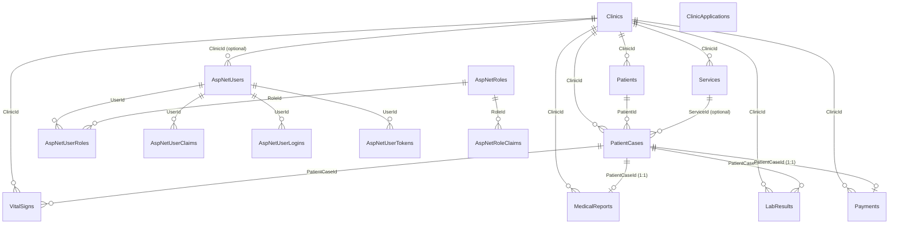

# ClinicOps — Database Tables & Relations

This document describes every entity/table in the backend, how they map to SQL tables, and what is wired to what (foreign keys vs logical references only).

**Source of truth:** `Domain/Entities/*`, `Data/ApplicationDbContext.cs`, migration `20260526122523_SomeModelChanged`.

**Database:** MySQL (via EF Core 8).

---

## Quick overview

| Category | Tables |
|----------|--------|
| **Clinic domain** | `Clinics`, `Patients`, `PatientCases`, `Services`, `VitalSigns`, `MedicalReports`, `LabResults`, `Payments`, `ClinicApplications` |
| **Auth (ASP.NET Identity)** | `AspNetUsers`, `AspNetRoles`, `AspNetUserRoles`, `AspNetUserClaims`, `AspNetRoleClaims`, `AspNetUserLogins`, `AspNetUserTokens` |

**Hub entity:** `Clinics` — most business data is scoped to a clinic.

**Case hub:** `PatientCases` — vitals, lab files, medical report, and payment hang off a case.

---

## Entity relationship diagram



`ClinicApplications` has **no** foreign keys to other tables (onboarding queue only).

---

## All tables (16 total)

### Clinic domain (9 tables)

| SQL table | Entity class | Primary key | Notes |
|-----------|--------------|-------------|--------|
| `Clinics` | `Clinic` | `Id` (Guid) | Root tenant |
| `Patients` | `Patient` | `Id` (Guid) | Belongs to one clinic |
| `PatientCases` | `PatientCase` | `Id` (Guid) | Visit / case for a patient |
| `Services` | `Service` | `Id` (Guid) | Priced services per clinic |
| `VitalSigns` | `VitalSigns` | `Id` (Guid) | Many per case |
| `MedicalReports` | `MedicalReport` | `Id` (Guid) | **One per case** (unique `PatientCaseId`) |
| `LabResults` | `LabResult` | `Id` (Guid) | Many PDF/files per case |
| `Payments` | `Payment` | `Id` (Guid) | **One per case** (unique `PatientCaseId`) |
| `ClinicApplications` | `ClinicApplication` | `Id` (int) | Standalone; no FKs |

### Identity (7 tables)

| SQL table | Entity | Primary key |
|-----------|--------|-------------|
| `AspNetUsers` | `ApplicationUser` | `Id` (string) |
| `AspNetRoles` | `IdentityRole` | `Id` (string) |
| `AspNetUserRoles` | `IdentityUserRole<string>` | `(UserId, RoleId)` |
| `AspNetUserClaims` | `IdentityUserClaim<string>` | `Id` (int) |
| `AspNetRoleClaims` | `IdentityRoleClaim<string>` | `Id` (int) |
| `AspNetUserLogins` | `IdentityUserLogin<string>` | `(LoginProvider, ProviderKey)` |
| `AspNetUserTokens` | `IdentityUserToken<string>` | `(UserId, LoginProvider, Name)` |

---

## Foreign key relationships (wired in EF)

These are enforced in the database with FK constraints.

| From table | FK column | To table | Cardinality | Delete behavior | Configured in |
|------------|-----------|----------|-------------|-----------------|---------------|
| `AspNetUsers` | `ClinicId` (nullable) | `Clinics` | Many users → 0..1 clinic | **Restrict** | `ApplicationDbContext` |
| `Patients` | `ClinicId` | `Clinics` | Many → one clinic | **Restrict** | `ApplicationDbContext` |
| `PatientCases` | `ClinicId` | `Clinics` | Many → one clinic | **Restrict** | `ApplicationDbContext` |
| `PatientCases` | `PatientId` | `Patients` | Many cases → one patient | **Cascade** | `ApplicationDbContext` |
| `PatientCases` | `ServiceId` (nullable) | `Services` | Many cases → 0..1 service | **Restrict** | `ApplicationDbContext` |
| `Services` | `ClinicId` | `Clinics` | Many → one clinic | **Restrict** | `ApplicationDbContext` |
| `VitalSigns` | `PatientCaseId` | `PatientCases` | Many → one case | **Cascade** | `ApplicationDbContext` |
| `VitalSigns` | `ClinicId` | `Clinics` | Many → one clinic | **Cascade** | EF convention (navigation) |
| `MedicalReports` | `PatientCaseId` | `PatientCases` | **1:1** (unique index) | **Cascade** | `ApplicationDbContext` |
| `MedicalReports` | `ClinicId` | `Clinics` | Many → one clinic | **Cascade** | EF convention |
| `LabResults` | `PatientCaseId` | `PatientCases` | Many → one case | **Cascade** | `ApplicationDbContext` |
| `LabResults` | `ClinicId` | `Clinics` | Many → one clinic | **Cascade** | EF convention |
| `Payments` | `PatientCaseId` | `PatientCases` | **1:1** (unique index) | **Cascade** | `ApplicationDbContext` |
| `Payments` | `ClinicId` | `Clinics` | Many → one clinic | **Cascade** | EF convention |
| `AspNetUserRoles` | `UserId` | `AspNetUsers` | Many | **Cascade** | Identity default |
| `AspNetUserRoles` | `RoleId` | `AspNetRoles` | Many | **Cascade** | Identity default |
| `AspNetUserClaims` | `UserId` | `AspNetUsers` | Many | **Cascade** | Identity default |
| `AspNetUserLogins` | `UserId` | `AspNetUsers` | Many | **Cascade** | Identity default |
| `AspNetUserTokens` | `UserId` | `AspNetUsers` | Many | **Cascade** | Identity default |
| `AspNetRoleClaims` | `RoleId` | `AspNetRoles` | Many | **Cascade** | Identity default |

### What “Restrict” vs “Cascade” means here

- **Restrict** on `ClinicId`: you cannot delete a clinic while rows still reference it.
- **Cascade** on `PatientId` → deleting a **patient** deletes their **patient cases** (and cascades further to vitals, labs, report, payment for those cases).
- **Cascade** on `PatientCaseId`: deleting a **case** deletes its vitals, lab results, medical report, and payment.
- **1:1** on `MedicalReports.PatientCaseId` and `Payments.PatientCaseId`: at most one report and one payment row per case.

---

## Logical references (NOT foreign keys)

These columns store IDs meant to point at users or doctors, but **EF does not configure a relationship** — no FK constraint in the database.

| Table | Column | Type | Intended meaning | Wired in EF? |
|-------|--------|------|------------------|--------------|
| `MedicalReports` | `DoctorId` | Guid | Doctor identifier | **No** — orphan Guid unless app enforces |
| `MedicalReports` | `DoctorUserId` | string? | ASP.NET Identity user id | **No** — should match `AspNetUsers.Id` by convention only |
| `LabResults` | `UploadedById` | string? | User who uploaded the file | **No** — should match `AspNetUsers.Id` |
| `Payments` | `ReceivedById` | Guid | Nurse/reception who took payment | **No** — comment says ApplicationUser; type is Guid (not string user id) |

The app is expected to resolve these in code; the database will not reject invalid IDs.

---

## Standalone / no relations

| Table | Why standalone |
|-------|----------------|
| `ClinicApplications` | Pending clinic sign-up requests; stores `ClinicName`, `AdminEmail`, `AdminPasswordHash`, `Status`, etc. Approval flow creates `Clinic` + `ApplicationUser` separately — no FK link back to the application row. |

---

## Per-entity detail

### `Clinics` → `Clinic`

| Column | Type | Notes |
|--------|------|--------|
| `Id` | Guid | PK |
| `Name` | string (200) | Required |
| `Address` | string? (300) | |
| `Phone` | string? (50) | |
| `LogoUrl` | string? (500) | |
| `Description` | string? (2000) | |
| `CreatedAt` | DateTime | |
| `IsActive` | bool | |
| `ClinicMode` | int enum | `SoloDoctor = 0`, `FullTeam = 1` |

**Referenced by (FK):** `AspNetUsers`, `Patients`, `PatientCases`, `Services`, `VitalSigns`, `MedicalReports`, `LabResults`, `Payments`.

**Navigation collections:** None defined on entity (all relations are “many side” only).

**Seed data:** Default test clinic `11111111-1111-1111-1111-111111111111`.

---

### `AspNetUsers` → `ApplicationUser` (extends `IdentityUser`)

| Column | Type | Notes |
|--------|------|--------|
| `Id` | string | PK (Identity) |
| `ClinicId` | Guid? | FK → `Clinics` |
| `CreatedAt` | DateTime | |
| `IsActive` | bool | |
| `DoctorDisplayName` | string? | |
| `SignatureUrl` | string? | |
| `StampUrl` | string? | |
| + standard Identity fields | | `UserName`, `Email`, `PasswordHash`, etc. |

**Relations:** Optional many-to-one → `Clinics`. Roles via `AspNetUserRoles`.

**Seed data:** SuperAdmin user (`Id = "SuperAdmin"`), no clinic.

---

### `Patients` → `Patient`

| Column | Type | Notes |
|--------|------|--------|
| `Id` | Guid | PK |
| `ClinicId` | Guid | FK → `Clinics` |
| `FirstName`, `LastName` | string (100) | Required |
| `DateOfBirth` | DateTime | |
| `Gender` | string? (10) | |
| `Phone` | string? (20) | |
| `CreatedAt` | DateTime | |
| `IsActive` | bool | |

**Relations:** → `Clinics`. ← `PatientCases` (cascade delete from patient).

---

### `PatientCases` → `PatientCase`

| Column | Type | Notes |
|--------|------|--------|
| `Id` | Guid | PK |
| `ClinicId` | Guid | FK → `Clinics` |
| `PatientId` | Guid | FK → `Patients` |
| `ServiceId` | Guid? | FK → `Services` |
| `Status` | int enum | See `PatientCaseStatus` below |
| `CreatedAt` | DateTime | |
| `CompletedAt` | DateTime? | |
| `Notes` | string? (500) | |

**Relations:**

- → `Clinics`, `Patients`, `Services` (optional)
- ← `VitalSigns` (many)
- ← `MedicalReports` (one, 1:1)
- ← `LabResults` (many)
- ← `Payments` (one, 1:1)

**`PatientCaseStatus`:** `Waiting = 1`, `InProgress = 2`, `InConsultation = 3`, `Completed = 4`, `Finished = 5`.

---

### `Services` → `Service`

| Column | Type | Notes |
|--------|------|--------|
| `Id` | Guid | PK |
| `ClinicId` | Guid | FK → `Clinics` |
| `Name` | string (300) | Required |
| `Price` | decimal | |
| `CreatedAt` | DateTime | |
| `IsActive` | bool | |

**Relations:** → `Clinics`. ← `PatientCases` (optional service on a case).

---

### `VitalSigns` → `VitalSigns`

| Column | Type | Notes |
|--------|------|--------|
| `Id` | Guid | PK |
| `ClinicId` | Guid | FK → `Clinics` |
| `PatientCaseId` | Guid | FK → `PatientCases` |
| `WeightKg` | decimal? | |
| `SystolicPressure`, `DiastolicPressure` | int? | |
| `TemperatureC` | decimal? | |
| `HeartRate` | int? | |
| `RecordedAt` | DateTime | |

**Relations:** → `Clinics`, `PatientCases` (many vitals per case).

---

### `MedicalReports` → `MedicalReport`

| Column | Type | Notes |
|--------|------|--------|
| `Id` | Guid | PK |
| `ClinicId` | Guid | FK → `Clinics` |
| `PatientCaseId` | Guid | FK → `PatientCases` (**unique**) |
| `Anamneza` | string? (2000) | |
| `Diagnosis` | string (500) | Required |
| `Therapy` | string | Required |
| `CreatedAt` | DateTime | |
| `DoctorId` | Guid | **No FK** |
| `DoctorUserId` | string? | **No FK** (Identity user id) |

**Relations:** → `Clinics`, `PatientCases` (1:1).

---

### `LabResults` → `LabResult`

| Column | Type | Notes |
|--------|------|--------|
| `Id` | Guid | PK |
| `ClinicId` | Guid | FK → `Clinics` |
| `PatientCaseId` | Guid | FK → `PatientCases` |
| `FileName` | string (255) | |
| `FilePath` | string (500) | |
| `ContentType` | string? (100) | |
| `UploadedAt` | DateTime | |
| `UploadedById` | string? (450) | **No FK** |

**Relations:** → `Clinics`, `PatientCases` (many files per case).

---

### `Payments` → `Payment`

| Column | Type | Notes |
|--------|------|--------|
| `Id` | Guid | PK |
| `ClinicId` | Guid | FK → `Clinics` |
| `PatientCaseId` | Guid | FK → `PatientCases` (**unique**) |
| `Amount` | decimal | |
| `PaymentMethod` | string? (50) | |
| `PaidAt` | DateTime | |
| `ReceivedById` | Guid | **No FK** |

**Relations:** → `Clinics`, `PatientCases` (1:1).

---

### `ClinicApplications` → `ClinicApplication`

| Column | Type | Notes |
|--------|------|--------|
| `Id` | int | PK, identity |
| `ClinicName` | string | |
| `AdminEmail` | string | |
| `AdminPasswordHash` | string | |
| `ClinicMode` | int enum | |
| `Status` | int enum | `Pending`, `Approved`, `Rejected` |
| `CreatedAtUtc` | DateTime | |
| `ReviewedAtUtc` | DateTime? | |
| `ReviewNote` | string? | |

**Relations:** None.

---

## Identity tables (wiring only)

| Table | Links to |
|-------|----------|
| `AspNetUserRoles` | `UserId` → `AspNetUsers`, `RoleId` → `AspNetRoles` |
| `AspNetUserClaims` | `UserId` → `AspNetUsers` |
| `AspNetUserLogins` | `UserId` → `AspNetUsers` |
| `AspNetUserTokens` | `UserId` → `AspNetUsers` |
| `AspNetRoleClaims` | `RoleId` → `AspNetRoles` |

**Seeded role:** `SuperAdmin` on `AspNetRoles`, assigned to seeded super admin user.

---

## Tenant / data flow (how things connect in practice)

```
Clinic
 ├── ApplicationUsers (staff: doctors, nurses, reception)     [FK ClinicId]
 ├── Patients                                                  [FK ClinicId]
 ├── Services (catalog + price)                                [FK ClinicId]
 └── PatientCase (per visit)
      ├── Patient                                              [FK PatientId]
      ├── Service (optional, for billing)                      [FK ServiceId]
      ├── VitalSigns (0..n)                                    [FK PatientCaseId + ClinicId]
      ├── LabResults (0..n PDFs)                               [FK PatientCaseId + ClinicId]
      ├── MedicalReport (0..1)                                 [FK PatientCaseId + ClinicId]
      └── Payment (0..1)                                       [FK PatientCaseId + ClinicId]
```

**Multi-tenancy:** Almost every clinical row duplicates `ClinicId` for filtering, even when it could be inferred via `PatientCase` → `Clinic`. This is intentional for query performance and clinic-scoped security.

---

## DbContext registration

Registered `DbSet`s in `ApplicationDbContext`:

- `Clinics`, `Patients`, `PatientCases`, `VitalSigns`, `MedicalReports`, `LabResults`, `Payments`, `ClinicApplications`, `Services`
- Plus all Identity sets via `IdentityDbContext<ApplicationUser>`

---

## Gaps / inconsistencies to be aware of

1. **`MedicalReport.DoctorId`** is `Guid` but **`ApplicationUser.Id`** is `string` — no FK; `DoctorUserId` is the Identity link but also has no FK.
2. **`Payment.ReceivedById`** is `Guid` while users use string IDs — likely legacy or mismatch; not enforced in DB.
3. **`Clinic` entity** has no inverse navigation properties (`Patients`, `Cases`, etc.) — relationships exist only on the “many” side.
4. **`ClinicApplications`** never links to created `Clinic` after approval — traceability is application-level only.

---

*Generated from the ClinicOps backend codebase. Re-run or update this file when entities or migrations change.*
